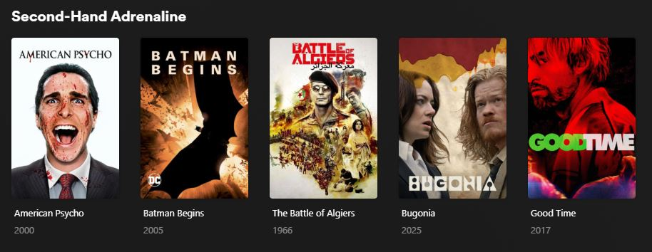

# Projectionist


A self-hosted AI curation layer for Plex. Reads your library, applies a mix of rule-based filters and AI judgment, and writes the results back as Collections pinned to your Plex home screen as browsable rows — refreshed automatically on a weekly schedule.



---

## Rows

### Movies

| Row | Logic | Description |
| --- | --- | --- |
| **Collecting Dust** | Rule-based | Unwatched films sitting in your library for 30+ days |
| **Easy Watch** | AI | Warm, low-stress comfort picks |
| **Existential & Atmospheric** | AI | Philosophical, meditative films that linger after the credits |
| **Second-Hand Adrenaline** | AI | High-tension, propulsive thrillers and crime films |
| **90-Minute Dash** | Rule-based | Unwatched films under 90 minutes |
| **Wildcard** | AI | A surprise collection invented fresh each week — name, theme, and films all chosen by the AI |

### TV Shows

| Row | Logic | Description |
| --- | --- | --- |
| **Collecting Dust** | Rule-based | Shows started but not watched in 60+ days |
| **Give it a Shot** | Rule-based | Shows with zero episodes watched |

Each run shuffles the results — rows feel different every week. No film appears in two movie rows (except 90-Minute Dash, which overlaps intentionally).

---

## Requirements

- [Docker Desktop](https://www.docker.com/products/docker-desktop/)
- A Plex server
- An AI provider — see [AI providers](#ai-providers) below

---

## Setup

### 1. Get the files

Download both files from the [latest release](https://github.com/rafvasq/projectionist/releases/latest):

```bash
curl -LO https://github.com/rafvasq/projectionist/releases/latest/download/docker-compose.yml
curl -LO https://github.com/rafvasq/projectionist/releases/latest/download/config.example.yaml
cp config.example.yaml config.yaml
```

### 2. Edit config.yaml

Fill in your Plex URL and token. To find your Plex token, follow [this guide](https://support.plex.tv/articles/204059436-finding-an-authentication-token-x-plex-token/). Then choose an AI provider — see [AI providers](#ai-providers) below.

### 3. Start

**Gemini** (no GPU required):

```bash
docker-compose up -d
```

**Ollama** (local, self-hosted):

```bash
docker-compose --profile ollama up -d
```

Projectionist runs once on startup, then on the configured cron schedule (default: Mondays at 3am).

### Viewing logs

```bash
docker-compose logs -f projectionist
```

A successful run ends with `Done — 7 collections updated and pinned to library views.`

---

## Configuration

All options with descriptions:

```yaml
plex:
  url: "http://192.168.1.X:32400"       # Plex server URL; use host.docker.internal when running on the same machine as Plex
  token: ""                             # Plex auth token
  library: "Movies"                     # Name of your movie library
  tv_library: "TV Shows"                # Name of your TV library

ai:
  provider: gemini                      # gemini | ollama

  # Gemini
  model: "gemini-2.5-flash"
  api_key: ""

  # Ollama
  # model: "llama3"
  # base_url: "http://ollama:11434"     # use http://localhost:11434 outside Docker

rows:
  max_results: 15                       # max items per row; duplicates across rows are excluded
  collecting_dust:
    enabled: true
    min_age_days: 30                    # how long a film must sit unwatched before qualifying
  easy_watch:
    enabled: true
  existential:
    enabled: true
  adrenaline:
    enabled: true
  quick_watch:
    enabled: true
    max_minutes: 90                     # maximum runtime in minutes
  tv_collecting_dust:
    enabled: true
    idle_days: 60                       # days since last watched episode before a show qualifies
  give_it_a_shot:
    enabled: true
  wildcard:
    enabled: true                        # AI invents a new collection name, theme, and film list each week

schedule:
  cron: "0 3 * * 1"                    # every Monday at 3am
```

Any row can be disabled by setting `enabled: false`.

---

## AI providers

### Gemini (default)

No GPU required. The free tier of `gemini-2.5-flash` handles a typical home library with one API call per AI row per run.

1. Get an API key at [aistudio.google.com](https://aistudio.google.com).

2. In `config.yaml`, set `provider: gemini` and fill in your `api_key` and `model`.

### Ollama (local, self-hosted)

No API costs, no data leaves your network. 7B–9B parameter models work well (`llama3`, `mistral`). Ollama runs as a sidecar in Docker — not exposed outside your machine.

GPU support requires the [NVIDIA Container Toolkit](https://docs.nvidia.com/datacenter/cloud-native/container-toolkit/install-guide.html).

1. In `config.yaml`, set `provider: ollama` and fill in the `model` and `base_url` under `# Ollama`.

2. Start with the Ollama profile:

   ```bash
   docker-compose --profile ollama up -d
   ```

3. Pull a model:

   ```bash
   docker-compose exec ollama ollama pull llama3
   ```
